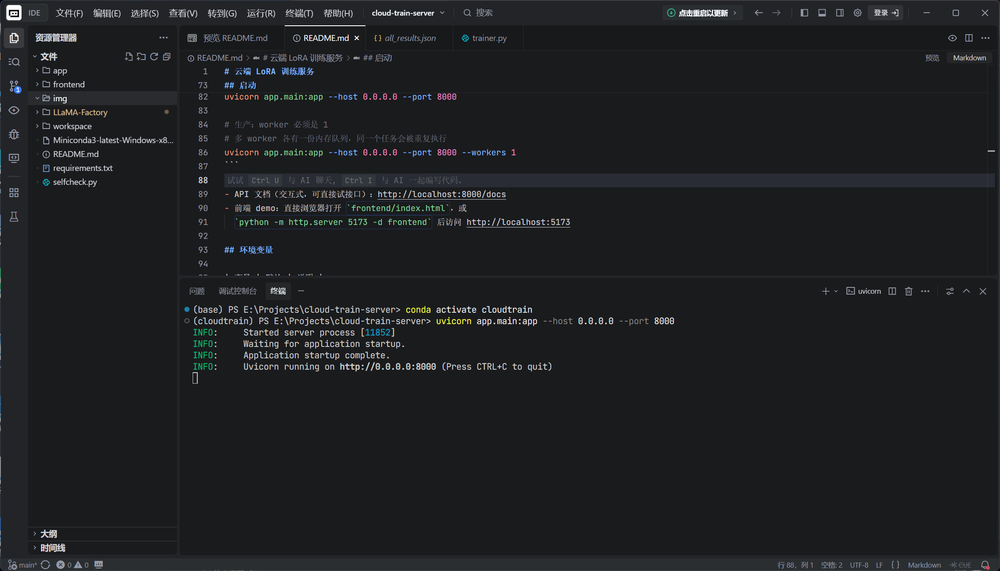
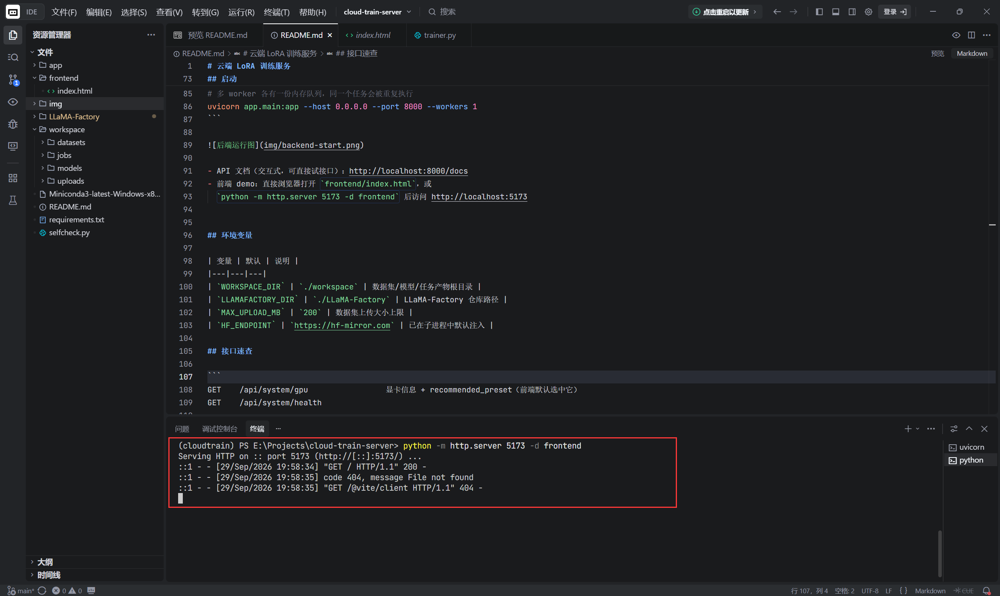
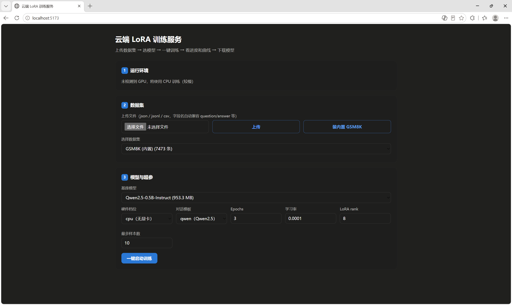

# 云端 LoRA 训练服务

上传数据集 → 选模型 → 一键启动训练 → 实时看进度和 loss 曲线 → 出错看友好报错 → 训完下载 LoRA。

后端不自己写训练循环，而是把 `llamafactory-cli train` 当子进程调起来，
通过读它写在磁盘上的 `trainer_log.jsonl` 反推进度，读 `stdout.log` 提取报错。

## 文件清单

```
cloud-train-server/
├── app/
│   ├── __init__.py
│   ├── config.py          # 路径 + 5 档硬件预设（显存安全参数）
│   ├── schemas.py         # Pydantic 模型 = 前端接口契约
│   ├── datasets_mgr.py    # 上传/校验/转 alpaca 格式/注册到 LLaMA-Factory
│   ├── models_mgr.py      # 基座模型列表 + 异步拉取
│   ├── errors.py          # 10 条错误模式 → 中文提示 + 修复建议
│   ├── trainer.py         # 队列 + 子进程 + 进度解析 + 产物打包
│   └── main.py            # FastAPI 全部路由
├── LLaMA-Factory/         # git submodule（训练引擎，非本仓库代码）
├── frontend/index.html    # 单文件前端 demo（ECharts 画曲线）
├── img/                   # README 截图
├── selfcheck.py           # 自检脚本（无需 GPU / 无需真 LLaMA-Factory）
├── requirements.txt
├── .gitignore             # 排除 workspace/ 模型权重、__pycache__、*.exe 等
├── .gitmodules            # submodule 声明
└── README.md
```

> `workspace/`（下载的模型、数据集、训练产物）已被 `.gitignore` 排除，首次运行时自动创建。

## 安装

```bash
git clone https://github.com/ayw618/cloud-train-server.git
cd cloud-train-server

# 1. Python 环境
conda create -n cloudtrain python=3.11 -y && conda activate cloudtrain

# 2. PyTorch（按你的 CUDA 版本选一条）
# pip install torch torchvision --index-url https://download.pytorch.org/whl/cu121  # CUDA 12.1
# pip install torch torchvision --index-url https://download.pytorch.org/whl/cu118  # CUDA 11.8
# pip install torch torchvision --index-url https://download.pytorch.org/whl/cpu    # 纯 CPU
pip install torch torchvision --index-url https://mirrors.nju.edu.cn/pytorch/whl/cpu    # 纯 CPU (南京大学的镜像源)


# 3. LLaMA-Factory（二选一）
# 方式一（推荐，本仓库已用 submodule 引入）：
#   若 clone 本仓库时加了 --recurse-submodules 则跳过此步；
#   否则执行下面这行补拉：
git submodule update --init --recursive
#
# 方式二（手动 clone，适用于直接下载 zip 而非 git clone 本仓库的情况）：
# git clone --depth 1 https://github.com/hiyouga/LLaMA-Factory.git
#
pip install -e "./LLaMA-Factory[torch,metrics]" -i https://pypi.mirrors.ustc.edu.cn/simple/

# 4. 服务依赖
# 此处安装结束会有依赖冲突
pip install -r requirements.txt -i https://pypi.mirrors.ustc.edu.cn/simple/
# 手动安装 starlette 0.46.2，避免冲突
pip install "starlette==0.46.2" "sse-starlette<3.0" -i https://pypi.mirrors.ustc.edu.cn/simple/

# 5. 下载一个基座模型
pip install modelscope
modelscope download --model Qwen/Qwen2.5-0.5B-Instruct --local_dir ./workspace/models/Qwen2.5-0.5B-Instruct

# 6(可选) 配置huggingface 镜像源，方便前端下载GSM8k数据集进行训练测试
# Windows 下需要手动设置
$env:HF_ENDPOINT = "https://hf-mirror.com"
# Linux 下默认设置
export HF_ENDPOINT=https://hf-mirror.com
```

## 先跑自检（推荐，不需要 GPU）

```bash
pip install httpx        # TestClient 需要
python selfcheck.py
```

它用一个假训练脚本冒充 `llamafactory-cli`，把「上传数据集 → 注册 → 建任务 →
生成 YAML → 起子进程 → 解析进度 → 打包下载」整条链路跑通，同时验证
硬件档位精度互斥、Turing 卡不推荐 bf16、错误友好化、崩溃路径。
全部通过打印 `ALL CHECKS PASSED`（当前 58 项全绿）。

## 启动
命令三选一执行
```bash
# 开发（Linux / macOS 可用 --reload 热重载）
uvicorn app.main:app --host 0.0.0.0 --port 8000 --reload

# Windows 开发：不要加 --reload！
# uvicorn 0.36+ 在 Windows + reload 下给 worker 选用 SelectorEventLoop，
# 而它不支持 asyncio 子进程，训练任务会瞬间失败并报“引擎内部错误：”。
uvicorn app.main:app --host 0.0.0.0 --port 8000

# 生产：worker 必须是 1
# 多 worker 各有一份内存队列，同一个任务会被重复执行
uvicorn app.main:app --host 0.0.0.0 --port 8000 --workers 1
```



- API 文档（交互式，可直接试接口）：http://localhost:8000/docs
- 前端 demo：直接浏览器打开 `frontend/index.html`，或
  `python -m http.server 5173 -d frontend` 后访问 http://localhost:5173





## 环境变量

| 变量 | 默认 | 说明 |
|---|---|---|
| `WORKSPACE_DIR` | `./workspace` | 数据集/模型/任务产物根目录 |
| `LLAMAFACTORY_DIR` | `./LLaMA-Factory` | LLaMA-Factory 仓库路径 |
| `MAX_UPLOAD_MB` | `200` | 数据集上传大小上限 |
| `HF_ENDPOINT` | `https://hf-mirror.com` | 已在子进程中默认注入 |

## 接口速查

```
GET    /api/system/gpu                 显卡信息 + recommended_preset（前端默认选中它）
GET    /api/system/health

GET    /api/datasets                   数据集列表
POST   /api/datasets/upload            multipart: file, display_name, clean_calc_markers
POST   /api/datasets/builtin/gsm8k     一键装内置 GSM8K
GET    /api/datasets/{name}/preview    前 N 条样本
DELETE /api/datasets/{name}

GET    /api/models                     本地模型 + 推荐清单
POST   /api/models/pull                异步拉取，返回 task_id
GET    /api/models/pull/{task_id}

POST   /api/jobs                       一键启动训练（最少只需 model_name + dataset_name）
GET    /api/jobs                       任务列表（?status=RUNNING 过滤）
GET    /api/jobs/{id}                  详情：进度/剩余时间/报错
GET    /api/jobs/{id}/stream           SSE：event: progress / point / done
GET    /api/jobs/{id}/curve            全量曲线（刷新页面后恢复用）
GET    /api/jobs/{id}/logs?tail=200    原始日志
POST   /api/jobs/{id}/cancel
DELETE /api/jobs/{id}

GET    /api/jobs/{id}/artifacts        产物列表 + 大小
GET    /api/jobs/{id}/loss_plot        loss 曲线 PNG，可直接 
GET    /api/jobs/{id}/download         LoRA 适配器 zip（约 17MB）
```

## 硬件档位

前端只传一个档位名，后端自动填一整套显存安全参数，用户不需要知道
`gradient_checkpointing` 是什么。

| 档位 | 适配显卡 | batch×accum | cutoff | 精度 | 峰值显存 |
|---|---|---|---|---|---|
| `gpu_4g` | RTX 3050 笔记本 | 1×16 | 512 | bf16 | ≈1.5 GB |
| `gpu_6g` | GTX 1660 / RTX 2060 | 2×8 | 512 | **fp16** | ≈1.9 GB |
| `gpu_8g` | RTX 3050 桌面 / 4060 | 4×4 | 768 | bf16 | ≈2.4 GB |
| `gpu_12g_plus` | RTX 3060 12G+ | 8×2 | 1024 | bf16 | ≈6.8 GB |
| `cpu` | 无显卡 | 1×8 | 384 | fp32 | 内存 ≈6 GB |

显存数值为 Qwen2.5-0.5B + LoRA 的同量级估算。

**为什么档位要按架构分而不是只按显存**：GTX 16xx / RTX 20xx 是 Turing 架构，
**不支持 bf16**，下发 `bf16: true` 会直接报错退出。所以 `_recommend_preset()`
做了架构判断——即使一张 Turing 卡有 11GB 显存，也只推荐 `gpu_6g`（fp16 档位）。

## 数据集格式

支持 json / jsonl / csv，字段名自动兼容：

| 标准字段 | 可接受的别名 |
|---|---|
| `instruction`（必需） | instruction / question / prompt / query / input_text / 问题 / 指令 |
| `output`（必需） | output / answer / response / completion / target / 答案 / 回答 |
| `input`（可选） | input / context / 上下文 |
| `system`（可选） | system / system_prompt / 系统提示 |

`clean_calc_markers=true` 会删掉 GSM8K 风格的 `<<48/2=24>>` 计算器标记，
但保留 `#### 72` 答案分隔符（这是 GSM8K 官方约定，评测时的正则锚点）。

## 前端要注意的三件事

1. **`RUNNING` 且 `total_steps == 0`** 是"加载模型 + tokenize 数据集"阶段，
   可能持续 10–60 秒。直接显示 0% 会让用户以为服务卡死，必须给文字提示。
2. **SSE 结束后要 `es.close()`**，否则连接泄漏。`done` 事件里已带最终状态。
3. **报错分三层展示**：`error_message`（红框大字）+ `error_hint`（浅色建议）
   + `error_raw`（折叠的原始 traceback）。

## nginx 部署要点

```nginx
client_max_body_size 500M;      # 要大于后端 MAX_UPLOAD_MB

location /api/ {
    proxy_pass http://127.0.0.1:8000;
    proxy_http_version 1.1;
    proxy_buffering off;        # ★ SSE 必需，否则进度一直 0%、训完才一次性刷出
    proxy_cache off;
    proxy_read_timeout 24h;     # ★ 训练可能几小时，别让 nginx 掐断
}
```

后端已在 SSE 响应里加了 `X-Accel-Buffering: no` 作双重保险。

## 已知限制

- 单卡串行，一次只跑一个训练任务（`_worker_loop` 单协程）。多卡需要改成
  按 GPU 分配 worker 并给子进程注入 `CUDA_VISIBLE_DEVICES`。
- 服务重启会把中断的 `RUNNING`/`PENDING` 任务标为 `FAILED`——训练子进程
  已被杀死，确实无法恢复，`load_jobs_from_disk` 会在 `error_message` 里说明原因。
- 状态存在内存字典 + JSON 文件，够单机用；多机部署要换 PostgreSQL。
- 没有鉴权。放公网前至少加一层 nginx basic auth 或反代网关。
- 只做 LoRA SFT，不含 LoRA 合并成完整模型（要的话加一个跑
  `llamafactory-cli export` 的子进程即可，逻辑与 `_run_training` 同构）。
